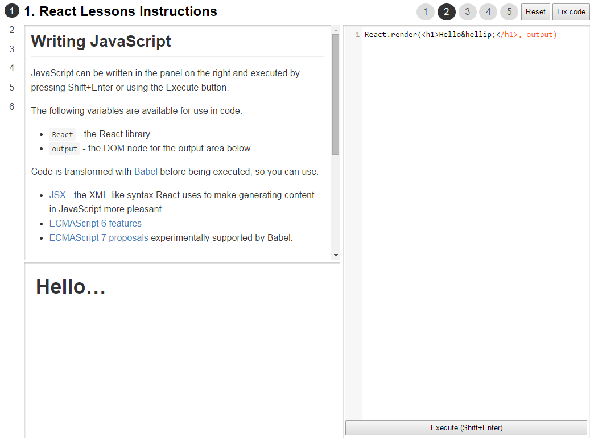
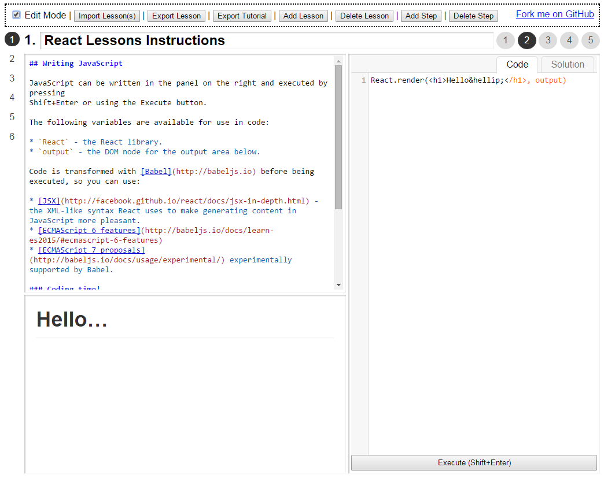

## React Lessons

React Lessons is a tool for creating - and taking - interactive [React](http://facebook.github.io/react/) tutorials, inspired by the [Ractive.js Tutorial](http://learn.ractivejs.org).

| Using | Editing |
|-------|---------|
|  |  |

A tutorial consists of a number of lessons. Each lesson can include one or more steps (numbered across the top-right of the page).

A lesson step consists of:

* Prose providing learning material.

* An outline for code to be written to practice the step's material.

### Writing JavaScript

JavaScript can be written in the panel on the right and executed by pressing
Shift+Enter or using the Execute button.

The following variables are available for use in code:

* `React` - the React library.
* `output` - the DOM node for the output area below.

Code is transformed with [Babel](http://babeljs.io) before being executed, so you can use:

* [JSX](http://facebook.github.io/react/docs/jsx-in-depth.html) - the XML-like syntax React uses to make generating content in JavaScript more pleasant.
* [ECMAScript 6 features](http://babeljs.io/docs/learn-es2015/#ecmascript-6-features)
* [ECMAScript 7 proposals](http://babeljs.io/docs/usage/experimental/) experimentally supported by Babel.

### Editing lessons

Use the "Edit Mode" checkbox to toggle editing mode.

In editing mode, you can change the lesson name and edit the content of each step.

#### Step prose

Step prose is written in [Markdown](http://daringfireball.net/projects/markdown/basics), with support for additional [GitHub Flavored Markdown](https://help.github.com/articles/github-flavored-markdown/) features.

#### Step code & solution

In editing mode, "Code" and "Solution" tabs will appear in the coding area:

* Code is what the user will see in the coding panel when they open the step.

  **Note:** Code will be automatically executed each time the step is opened.

* Solution (if provided) will allow use of the "Fix code" button to see a solution for the coding challenge.

### Creating and deleting lessons and steps

In editing mode, extra toolbar buttons are also displayed to allow you to add new lessons and steps, or to delete the current lesson or step.

When you add more lessons to a tutorial, a menu will pop up on the left side of the page to allow you to navigate between them.

### Exporting lessons and tutorials

You can export the current lesson using the "Export Lesson" button, or the complete tutorial using "Export Tutorial" button.

You will be prompted to download a `.json` file containing exported data.

### Importing lessons and tutorials

To import a lesson or a tutorial, use the "Import Lesson(s)" button to select a `.json` file, or drag and drop a `.json` file anywhere on the page.

**Warning:** if you import a tutorial, its lessons will replace *everything* you currently have.

## MIT Licensed
